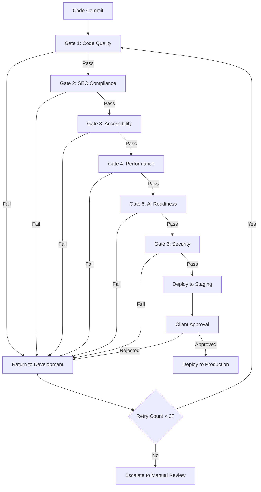

# Quality Gates System

**Skill Type:** Process & Validation
**Domain:** Quality Assurance
**System:** Multi-Site Website Development

## Overview

This skill defines the 6-gate sequential validation system that ensures consistent quality across all client sites before production deployment.

## When to Apply This Skill

- Before deploying any site to production
- After major code changes to shared components
- When onboarding new client sites
- During quarterly quality audits
- When Claude Code agents perform automated validation

## Core Concept

**Sequential Validation:** Gate N+1 only executes if Gate N passes. Any gate failure returns to development phase with specific fix recommendations.

**Maximum Retries:** 3 attempts per gate. After 3 failures, escalate to manual review.

##The 6 Quality Gates

### Gate 1: Code Quality

**Purpose:** Ensure code meets style standards and type safety requirements.

**Checks:**
- ESLint passes with zero errors
- Prettier formatting applied
- TypeScript compilation succeeds (`tsc --noEmit`)
- No `any` types without explicit justification comments
- Import sorting follows convention

**Pass Criteria:**
```yaml
pass_criteria:
  eslint_errors: 0
  eslint_warnings: <10
  typescript_errors: 0
  prettier_violations: 0
```

**Automation:**
```bash
nx run-many --target=lint --all
nx run-many --target=type-check --all
```

**Common Failures & Fixes:**
- **Unused imports:** Remove via `eslint --fix`
- **Type errors:** Add explicit types to function returns
- **Formatting:** Run `prettier --write .`

---

### Gate 2: SEO Compliance

**Purpose:** Validate search engine optimization and AI crawler accessibility.

**Checks:**
- Meta tags present on all pages (title, description)
- Schema markup valid (JSON-LD on key pages)
- Heading hierarchy correct (single H1, progressive H2-H6)
- Image alt text coverage >90%
- Sitemap generated and accessible
- `robots.txt` allows AI crawlers (GPTBot, ClaudeBot)
- `llms.txt` present and valid

**Pass Criteria:**
```yaml
pass_criteria:
  meta_tags_present: true
  meta_tags_unique: true
  schema_markup_valid: true
  heading_hierarchy_correct: true
  image_alt_text_coverage: >90%
  seo_score: >90
  llms_txt_present: true
```

**Automation:**
```bash
# Via Claude Code agent
claude-code --agent=seo-optimizer --project=sites/client-a
```

**Common Failures & Fixes:**
- **Missing meta descriptions:** Add to frontmatter
- **Invalid schema:** Use `@workspace/seo-utils` generators
- **Multiple H1s:** Refactor heading structure
- **Missing alt text:** Add descriptive alt to all images

---

### Gate 3: Accessibility (WCAG 2.1 AA)

**Purpose:** Ensure compliance with Web Content Accessibility Guidelines Level AA.

**Checks:**
- Zero critical (Level A) violations
- <5 warnings (Level AA) per page
- Color contrast ratios meet minimum (4.5:1 normal, 3:1 large text)
- All interactive elements keyboard-accessible
- ARIA attributes correct on custom components
- Focus indicators visible on all focusable elements
- Form labels associated with inputs

**Pass Criteria:**
```yaml
pass_criteria:
  critical_violations: 0
  warnings: <5
  color_contrast_violations: 0
  keyboard_navigable: true
  aria_valid: true
  focus_indicators_visible: true
```

**Automation:**
```bash
# Via Playwright + axe-core
nx run-many --target=test:a11y --all

# Via Claude Code agent
claude-code --agent=accessibility-auditor --project=sites/client-a
```

**Common Failures & Fixes:**
- **Insufficient contrast:** Adjust color palette in `tailwind.config.cjs`
- **Missing ARIA labels:** Add `aria-label` to icon-only buttons
- **Keyboard navigation broken:** Ensure `tabindex` logical, avoid `tabindex > 0`
- **Missing form labels:** Wrap inputs in `<label>` or use `aria-labelledby`

---

### Gate 4: Performance (Core Web Vitals)

**Purpose:** Ensure fast page loads and excellent user experience.

**Checks:**
- Largest Contentful Paint (LCP) <2.5 seconds
- First Input Delay (FID) <100ms (or Interaction to Next Paint <200ms)
- Cumulative Layout Shift (CLS) <0.1
- Total JavaScript bundle <500KB per page
- Images optimized (WebP format, responsive sizes)
- Lighthouse Performance score >90

**Pass Criteria:**
```yaml
pass_criteria:
  lcp: <2.5s
  fid: <100ms # or inp: <200ms
  cls: <0.1
  javascript_bundle: <500KB
  lighthouse_performance: >90
  lighthouse_seo: >90
```

**Automation:**
```bash
# Via Lighthouse CI
npm run lighthouse-ci

# Via PageSpeed Insights API
curl "https://www.googleapis.com/pagespeedonline/v5/runPagespeed?url=..."
```

**Common Failures & Fixes:**
- **Slow LCP:** Optimize hero images, remove `client:load` from above-fold components
- **High CLS:** Reserve space for images (`width` and `height` attributes)
- **Large bundles:** Review dependencies with `nx run client-a:analyze`
- **Slow FID:** Reduce JavaScript execution time, use `client:idle` for non-critical features

---

### Gate 5: AI Readiness

**Purpose:** Validate content is discoverable and accessible by AI crawlers.

**Checks:**
- All content pages render as static HTML (no client-side rendering for content)
- `robots.txt` allows AI crawlers (GPTBot, ClaudeBot, Bingbot, Google-Extended)
- `llms.txt` present at root with project description
- Schema markup provides structured data for AI comprehension
- Server logs show AI crawler activity (post-deployment validation)

**Pass Criteria:**
```yaml
pass_criteria:
  static_html_content: true
  robots_txt_ai_friendly: true
  llms_txt_present: true
  llms_txt_valid: true
  schema_markup_coverage: >90%
  ai_crawler_access_confirmed: true # (post-launch check)
```

**Automation:**
```bash
# Via Claude Code agent
claude-code --agent=ai-readiness-auditor --project=sites/client-a

# Manual validation
curl -I https://site.com/robots.txt | grep "200 OK"
curl https://site.com/llms.txt
```

**Common Failures & Fixes:**
- **robots.txt blocks crawlers:** Remove `Disallow: /` for GPTBot, ClaudeBot
- **Missing llms.txt:** Create at `public/llms.txt` with project description
- **Client-side content rendering:** Convert components to static or SSR
- **No schema markup:** Add JSON-LD using `@workspace/seo-utils`

---

### Gate 6: Security

**Purpose:** Ensure no known vulnerabilities in dependencies or code.

**Checks:**
- npm audit shows zero high/critical vulnerabilities
- No hardcoded secrets in codebase (API keys, passwords)
- Content Security Policy (CSP) headers configured
- HTTPS enforced in production
- Dependencies up-to-date (<90 days old for critical packages)

**Pass Criteria:**
```yaml
pass_criteria:
  npm_audit_high: 0
  npm_audit_critical: 0
  hardcoded_secrets: 0
  csp_headers_present: true
  https_enforced: true
```

**Automation:**
```bash
# Dependency audit
pnpm audit

# Secret scanning (via security-auditor agent)
claude-code --agent=security-auditor --project=sites/client-a

# Manual checks
grep -r "API_KEY\s*=" sites/client-a/src/ # Should return nothing
```

**Common Failures & Fixes:**
- **High/critical vulnerabilities:** Run `pnpm audit --fix` or update dependencies
- **Hardcoded secrets:** Move to `.env` files (gitignored), use `import.meta.env`
- **Missing CSP:** Add headers in `astro.config.mjs` or web server config
- **HTTP in production:** Configure HTTPS in deployment platform or server

---

## Gate Orchestration Workflow



## Invocation Methods

### 1. Automated (CI/CD)

**Trigger:** Every Git push to `staging` branch

```yaml
# .github/workflows/quality-gates.yml
name: Quality Gates

on:
  push:
    branches: [staging]

jobs:
  quality-gates:
    runs-on: ubuntu-latest
    steps:
      - uses: actions/checkout@v3
      - run: pnpm install
      - run: pnpm quality-gates --site=${{ matrix.site }}
```

### 2. Manual (CLI)

```bash
# Run all gates for specific site
pnpm quality-gates --site=client-a

# Run specific gate
pnpm quality-gates --site=client-a --gate=seo

# Skip specific gate (emergency only, requires approval)
pnpm quality-gates --site=client-a --skip=performance
```

### 3. Via Claude Code Orchestrator

```bash
# Invoke quality-gate-orchestrator agent
claude-code --agent=quality-gate-orchestrator --project=sites/client-a
```

## Reporting

**Gate Failure Report Format:**

```markdown
## Quality Gate Failure Report

**Site:** client-a
**Gate:** Gate 3 - Accessibility
**Status:** FAILED
**Attempt:** 1/3

### Critical Issues (Must Fix)
- [CRITICAL] Button "Submit" missing accessible label (line 42, ContactForm.astro)
- [CRITICAL] Color contrast ratio 2.8:1 on .cta-button (requires 4.5:1)

### Warnings (Should Fix)
- [WARNING] Missing `lang` attribute on <html> tag (BaseLayout.astro)
- [WARNING] Redundant ARIA role on <nav role="navigation">

### Recommendations
1. Add `aria-label="Submit contact form"` to submit button
2. Change .cta-button text color from #888 to #333
3. Add `lang="en"` to <html> in BaseLayout.astro
4. Remove redundant ARIA roles (semantic HTML sufficient)

### Next Steps
- Fix critical issues
- Re-run quality gates: `pnpm quality-gates --site=client-a`
```

## Success Metrics

**Gate Pass Rate (Target: >95%)**

```
Gate Pass Rate = (Successful First-Pass Deployments / Total Deployments) × 100
```

**Time to Pass (Target: <30 minutes per site)**

```
Average Time = Total Gate Execution Time / Number of Sites
```

**Gate Effectiveness (Target: <5% post-launch issues)**

```
Effectiveness = (Issues Prevented by Gates / Total Potential Issues) × 100
```

## Related Documentation

- [Success Metrics](../../../../docs/SUCCESS_METRICS.md)
- [SEO & WCAG Standards](../seo-wcag-standards/SKILL.md)
- [Astro Best Practices](../astro-best-practices/SKILL.md)

## Version History

- **v1.0 (2025-11-17):** Initial quality gates system documentation
